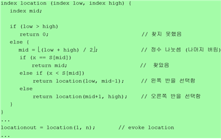
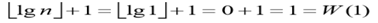
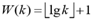
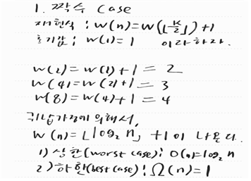

## 분할정복 - 이진탐색

 ###1. 설계 전략<tr>
 (1) 찾는 값인 index가 배열의 중간에 위치하고 있는 항목과 같으면 true,  
 (2) Divide(분할) : 그렇지 않으면, 배열을 반으로 나누어서
  - index가 중앙에 위치한 항목보다 작으면 왼쪽 배열 반쪽을 선택
  - 그렇지 않으면 오른쪽 배열 반쪽을 선택한다.<tr>
(3) Conquer(정복) : 선택된 반쪽 배열에서 index를 찾는다.   

### 2. 슈도코드

  

###3. 알고리즘 증명
#### 1) 증명 : 수학적 귀납법
#### 2) 귀납 출발점 : n = 1이면 다음이 성립한다. <tr>
 
#### 3) 귀납 가정 : n > 0이고, 0 < k < n인 모든 k에 대해서 
#### 4) 귀납 단계 : n이 짝수이면
 
